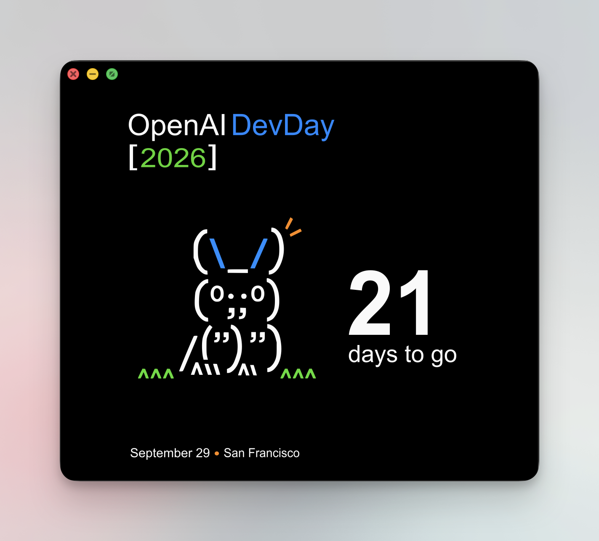

# DevDay 2026 Countdown

A quiet countdown to OpenAI DevDay. Keep the artwork on your desktop, add the day count to your Dock or menu bar, and share a card when you feel like it.



*The Mac companion card. The desktop widget uses the same artwork without window controls.*

This is an **unofficial community project** for DevDay on **September 29, 2026, in San Francisco**. It runs locally, with no account, API key, analytics, or network connection required.

## What it does

- **Desktop and Home Screen widgets.** A new illustrated card each day, from 21 days remaining through TODAY.
- **Choose where the count appears.** In Mac Settings, enable **Show in Dock**, **Show in menu bar**, both, or neither for widget-only use.
- **Share image and caption together.** Export a square or a properly composed portrait Story, with a caption for attending in person, following virtually, or simply counting down.
- **Stay faithful to the artwork.** Original compositions, restored vector illustrations, and crisp vector typography.

## Get started

This repository is a **source release**. There is no notarized Mac installer or TestFlight build yet.

You need a Mac with Xcode and either macOS 14+ or an iPhone/iPad running iOS 17+.

1. Clone or download this repository and open `DevDay2026.xcodeproj`.
2. Choose the **DevDayMac** scheme for Mac, or **DevDayiOS** for iPhone/iPad.
3. In **Signing & Capabilities**, choose your team for both the app target and its widget extension. Change the bundle identifiers to your own unique values if required by your provisioning setup; keep the widget identifier prefixed with its app identifier.
4. Choose a run destination and press **Run**. No package installation or project generation is needed.

### Add the widget

**Mac:** Run the app once. Right-click the desktop → **Edit Widgets** → find **DevDay 2026**. Add the large square for the best view of the original artwork.

**iPhone or iPad:** Install and open the app, then add **DevDay 2026** from the Home Screen widget gallery.

The live widget is independent of the companion card’s preview selection. Tap it to open today’s card. WidgetKit controls refresh timing; the display may update shortly after midnight rather than at exactly 00:00.

### Keep it minimal

Right-click the companion card on Mac, or touch and hold on iOS, for sharing and day previews. On Mac, the same menu opens **Settings**:

| Show in Dock | Show in menu bar | Result |
| --- | --- | --- |
| Off | Off | Widget-only, the default |
| On | Off | Dock icon with the live day count |
| Off | On | Compact menu-bar countdown |
| On | On | Both |

With both off, reopen the app or tap the widget to reach the card and its Settings menu. Previewing another day adds a small **Back to today** control; it does not change the live widget, Dock badge, or menu-bar count.

## Share a day

Open **Share this day** from the card’s context menu, choose a format and attendance option, then select **Share image + caption**.

| Format | Export |
| --- | --- |
| Square | 1080 × 1080 PNG, matching the original card composition |
| Story | 1080 × 1920 PNG, with independently arranged artwork and text |

**Following along** is the default caption. **In person** and **Virtually** change the wording, including on event day. Every caption includes `@OpenAIDevs` and `#DevDay2026`; none includes a URL.

The native share sheet receives the PNG and caption in one action. Available destinations and caption insertion are controlled by the receiving app. **X/Instagram end-to-end caption insertion is not yet verified; this project does not promise automatic posting or universal caption prefill.** No social credentials are stored.

## How the countdown works

The date is calculated in **America/Los_Angeles**, the event’s timezone. Everyone sees the same calendar-day count, wherever they are.

- Before the 21-day art series: the real count is displayed with the first illustration.
- September 8–28: the matching daily card.
- September 29: TODAY.
- September 30 onward: a post-event message.

The app refreshes while running and when it becomes active. Widget timelines include upcoming day boundaries. Page-turn motion respects Reduce Motion, and the card exposes a spoken countdown label.

## Develop

The app is written in SwiftUI and WidgetKit. It has no third-party runtime dependencies.

```sh
./Scripts/test.sh

# Compile without signing for local verification.
xcodebuild -project DevDay2026.xcodeproj -scheme DevDayMac \
  -derivedDataPath /tmp/devday-mac CODE_SIGNING_ALLOWED=NO build

xcodebuild -project DevDay2026.xcodeproj -scheme DevDayiOS \
  -sdk iphonesimulator -derivedDataPath /tmp/devday-ios \
  CODE_SIGNING_ALLOWED=NO build
```

The tests cover Pacific-time boundaries, TODAY and post-event states, artwork selection, daylight-saving transitions, singular captions, attendance wording, tags, and the absence of share-caption URLs. See [verification notes](docs/VERIFICATION.md) for runtime checks and remaining limits.

| Directory | Purpose |
| --- | --- |
| `App/` | Minimal companion, display settings, and native sharing |
| `Widget/` | Widget views and timeline provider |
| `Shared/` | Date and caption logic, card layouts, compiled asset inputs |
| `Artwork/` | Restored SVGs, source hashes, and layout measurements |
| `Scripts/` | Tests, project generation, and card exports |

`Scripts/render_cards.sh` renders all 44 share images using the same SwiftUI view as the app. It writes to `Exports/`, which is excluded from Git. The committed Xcode project is ready to open; `Scripts/generate_project.rb` is only needed when changing target structure and requires the Ruby `xcodeproj` gem.

## Artwork and attribution

The illustrations are traced from the supplied raster references into Bezier curves, with light contour smoothing. Text is reconstructed as vector outlines at measured positions. These are restored derivatives, not official brand-master vectors. The supplied compositions remain the visual source of truth; no generated replacement animals are included.

Source filenames and SHA-256 hashes are recorded in `Artwork/provenance.json`. `Artwork/layouts.json` records the original layout measurements. Event information comes from the [official DevDay page](https://devday.openai.com/); that link is documentation only.

Code is [MIT licensed](LICENSE). Artwork, marks, and derived font outlines are excluded; see [the artwork notice](ARTWORK-NOTICE.md). This project is not affiliated with or endorsed by OpenAI.
